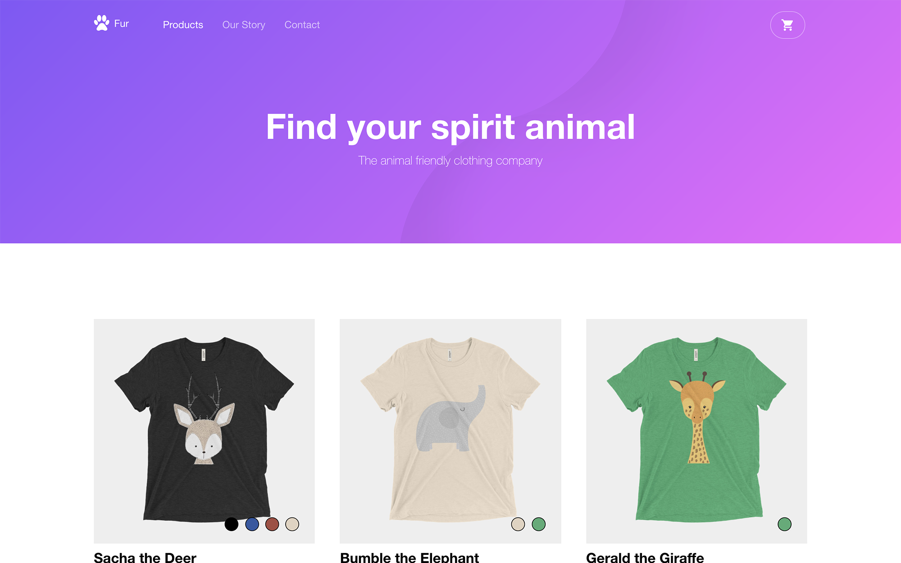

## Fur

E-commerce template for Hugo. Browse through a [live demo](https://adept-lemongrass.cloudvent.net).

Fur was made by [CloudCannon](http://cloudcannon.com/), a JAMStack platform for the whole team.

Find more templates, themes and Jekyll tutorials at [CloudCannon Academy](https://learn.cloudcannon.com/).

## Features

* List product with multiple colours and sizes
* Take payment online using SnipCart
* Contact form
* Optimised for editing in [CloudCannon](http://cloudcannon.com/)
* RSS/Atom feed
* SEO tags
* Google Analytics

## Setup

1. Add your site and author details in `config.toml`.
2. Add your Google Analytics, Google Maps API key and [SnipCart key](https://snipcart.com/) to `config.toml`.
3. Get a workflow going to see your site's output (with [CloudCannon](https://app.cloudcannon.com/) or Hugo locally).

## Develop

Fur was built with [Hugo](https://gohugo.io/) version 0.86, but should support newer versions as well.

Run the standalone executable `hugo` to serve the site locally:

~~~bash
$ hugo server
~~~

## Editing

Fur is already optimised for adding, updating and removing products and editing the navigation and footer in CloudCannon.

### Products

* Add, update or remove a product in the *products* section.
* Change the defaults when new products are created in `content/products/_defaults.md`.

### Contact Form

* Preconfigured to work with [CloudCannon](https://app.cloudcannon.com/), but easily changed to another provider (e.g. [FormSpree](https://formspree.io/)).
* Sends email to the address listed in author details.

### Social Media
* Add, update or remove social media links using the data editor.
